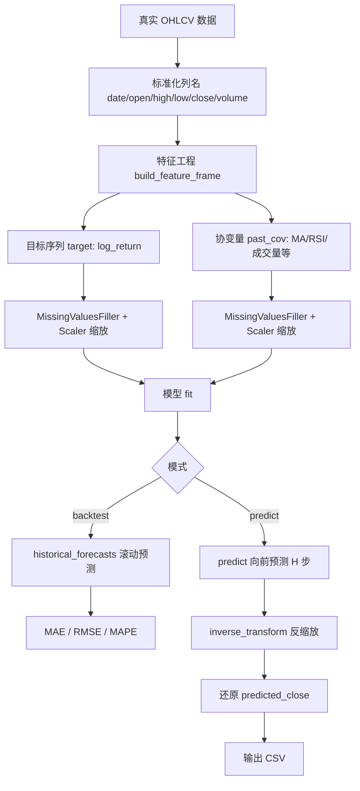

# 股票预测与方法讲解

本文档说明 `stock_analysis` 模块的**预测目标、建模方法、算法原理、回测逻辑**，以及如何解读预测结果。  
操作步骤请参阅 [README.md](./README.md)。

---

## 目录

1. [总体思路](#1-总体思路)
2. [预测什么](#2-预测什么)
3. [完整流程图](#3-完整流程图)
4. [数据与特征；；j工程](#4-数据与特征工程)
5. [Darts 时序表示](#5-darts-时序表示)
6. [模型方法详解](#6-模型方法详解)
7. [训练、回测与正式预测](#7-训练回测与正式预测)
8. [价格还原公式](#8-价格还原公式)
9. [评估指标解读](#9-评估指标解读)
10. [结果如何解读](#10-结果如何解读)
11. [方法局限与假设](#11-方法局限与假设)
12. [进阶扩展方向](#12-进阶扩展方向)

---

## 1. 总体思路

本系统采用**监督学习式时序预测**框架，核心逻辑是：

> 用过去 N 天的收益率和技术指标，预测未来 H 天的收益率，再还原为预测价格。

与传统「看 K 线猜方向」不同，这里把问题形式化为：

```
y_{t+1}, y_{t+2}, ..., y_{t+H} = f(y_t, y_{t-1}, ..., X_t, X_{t-1}, ...)
```

其中：

- `y` = 目标序列（对数收益率或收盘价）
- `X` = 协变量（成交量、均线、RSI 等）
- `f` = 由 LightGBM / XGBoost / 线性回归 / ARIMA 学习的映射函数
- `H` = `forecast_horizon`（默认 5 个交易日）

底层引擎为 [Darts](https://unit8co.github.io/darts/)，它将时序问题转化为「滞后特征 + 机器学习」的统一 `fit()` / `predict()` 接口。

---

## 2. 预测什么

### 2.1 默认目标：对数收益率（log_return）

**定义：**

```
log_return_t = ln(close_t / close_{t-1})
```

**为何不用原始收盘价？**


| 对比项 | 收盘价 close        | 对数收益率 log_return |
| --- | ---------------- | ---------------- |
| 平稳性 | 通常非平稳，长期趋势明显     | 更接近平稳，适合统计建模     |
| 可比性 | 100 元与 10 元股票不可比 | 百分比变化，跨股票可比      |
| 叠加性 | 不能直接相加           | 多日收益可近似相加        |
| 极端值 | 高价股数值大，影响模型      | 缩放后更稳定           |


**预测输出：**

- 直接输出：未来 H 日的 `log_return`
- 间接输出：通过公式还原 `predicted_close`（预测收盘价）

### 2.2 可选目标：收盘价（close）

设置 `--target close` 时，模型直接预测未来收盘价。

**适用场景：** 单只股票、短周期、需要直观价格输出。  
**缺点：** 非平稳性更强，长期预测偏差通常更大。  
**建议：** 研究场景优先使用 `log_return`。

---

## 3. 完整流程图

### 3.1 数据处理与预测流水线




### 3.2 三种运行模式对比


| 模式   | 命令         | 训练数据        | 输出            | 用途      |
| ---- | ---------- | ----------- | ------------- | ------- |
| 训练   | `train`    | 前 80% 历史    | 保存模型          | 开发调试    |
| 回测   | `backtest` | 滚动窗口重训      | 误差指标 + 历史预测序列 | 评估模型可靠性 |
| 正式预测 | `predict`  | **100% 历史** | 未来 H 日预测      | 生产使用    |


---

## 4. 数据与特征工程

### 4.1 原始输入（OHLCV）


| 字段     | 含义   |
| ------ | ---- |
| date   | 交易日期 |
| open   | 开盘价  |
| high   | 最高价  |
| low    | 最低价  |
| close  | 收盘价  |
| volume | 成交量  |


数据仅保留**真实交易日**，不填充节假日空档（`fill_missing_dates=False`）。

### 4.2 自动构造的特征

实现位置：`features.py` → `build_feature_frame()`

#### 目标变量


| 名称         | 公式                                    | 角色         |
| ---------- | ------------------------------------- | ---------- |
| log_return | ln(close_t / close_{t-1})             | 默认预测目标     |
| return_1d  | (close_t - close_{t-1}) / close_{t-1} | 辅助计算，不直接入模 |


#### 协变量（Past Covariates）

模型训练时可使用的**已知历史信息**：


| 特征                | 公式 / 含义               | 金融含义   |
| ----------------- | --------------------- | ------ |
| volume            | 原始成交量                 | 市场活跃度  |
| ma5 / ma20 / ma60 | 收盘价的 5/20/60 日均线      | 短中长期趋势 |
| volatility_20     | 20 日 log_return 标准差   | 近期波动风险 |
| rsi_14            | 14 日相对强弱指标            | 超买超卖   |
| volume_ratio      | volume / volume_ma5   | 放量/缩量  |
| hl_spread         | (high - low) / close  | 日内振幅   |
| oc_spread         | (close - open) / open | 日内涨跌   |


前 60 个交易日因 MA60 等指标无法计算会被丢弃（`dropna`）。

### 4.3 时间编码（add_encoders）

除上述特征外，Darts 自动注入日历特征：

```python
add_encoders = {
    "cyclic": {"future": ["dayofweek", "month"]},       # 周期性 sin/cos 编码
    "datetime_attribute": {"future": ["dayofweek"]},    # 星期几（0=周一）
}
```

**作用：** 捕捉「周一效应」「月末效应」等季节性规律，无需手动构造。

---

## 5. Darts 时序表示

### 5.1 TimeSeries 结构

Darts 将 pandas DataFrame 转为 `TimeSeries` 对象：

```python
target = TimeSeries.from_dataframe(df, time_col="date", value_cols="log_return", freq="B")
past_cov = TimeSeries.from_dataframe(df, time_col="date", value_cols=[...], freq="B")
```

- `target`：**单变量**目标序列（要预测的量）
- `past_cov`：**多变量**协变量（仅使用过去值，预测时不泄露未来）

### 5.2 协变量类型说明

```
                    ┌─────────────────────────────────────┐
  过去 ◀────────────│  past_covariates（成交量、MA、RSI）  │
                    └─────────────────────────────────────┘
                    
  预测目标 ────────▶  target（log_return）
                    
                    ┌─────────────────────────────────────┐
  未来 ◀────────────│  future_covariates（本系统未使用）   │
                    └─────────────────────────────────────┘
```

本系统使用 **past_covariates**：预测第 t+1 天时，只能使用 t 及之前已知的成交量和指标，符合真实交易的信息约束。

### 5.3 数据缩放

```python
Pipeline([MissingValuesFiller(), Scaler()])
```


| 步骤                    | 作用                         |
| --------------------- | -------------------------- |
| MissingValuesFiller   | 填充缺失值                      |
| Scaler (MinMaxScaler) | 将每个特征缩放到 [0, 1]，加速 ML 模型收敛 |


预测完成后通过 `inverse_transform()` 还原到原始尺度。

---

## 6. 模型方法详解

### 6.1 共同机制：滞后特征表（Lag Tabularization）

LightGBM、XGBoost、Linear 均属于 Darts 的 **GlobalForecastingModel**，核心思想：

> 把时序问题变成「表格回归」——每一行是一个训练样本。

**示例**（`lags=3`, `output_chunk_length=2`）：


| 样本  | 特征（X）                                              | 标签（y）            |
| --- | -------------------------------------------------- | ---------------- |
| 1   | y_{t-3}, y_{t-2}, y_{t-1}, vol_{t-1}, ma5_{t-1}... | y_t, y_{t+1}     |
| 2   | y_{t-2}, y_{t-1}, y_t, vol_t, ma5_t...             | y_{t+1}, y_{t+2} |


默认配置：

- `lags=30`：使用过去 30 个交易日的目标滞后
- `lags_past_covariates=10`：使用过去 10 日的协变量滞后
- `output_chunk_length=5`：一次预测未来 5 日

### 6.2 LightGBM（默认推荐）

**原理：** 梯度提升决策树（GBDT），通过多棵浅树逐步拟合残差。

**在本系统中的优势：**

- 对非线性关系（量价的复杂交互）拟合能力强
- 训练速度快，适合日线级别数千条数据
- 对特征缩放不敏感（但仍做了 Scaler 以统一流程）
- 支持多步输出（`output_chunk_length=5`）

**默认参数：**

```python
LightGBMModel(
    lags=30,
    lags_past_covariates=10,
    output_chunk_length=5,
    random_state=42,
)
```

**适合：** 大多数股票日线预测场景的**首选模型**。

### 6.3 XGBoost

**原理：** 与 LightGBM 类似的 GBDT，正则化方式不同。

**对比 LightGBM：**

- 有时在小数据集上泛化更好
- 训练略慢
- 需额外安装：`pip install xgboost`

**适合：** 作为 LightGBM 的对照实验模型。

### 6.4 Linear Regression（线性回归）

**原理：**

```
y = w_1 * lag_1 + w_2 * lag_2 + ... + w_n * cov_n + b
```

**优势：**

- 可解释性最强（系数正负表示因子方向）
- 训练极快，不易过拟合（在特征不多时）

**劣势：**

- 无法捕捉复杂非线性（如 RSI 超买后的反转）

**适合：** 基线模型、因子方向验证。

### 6.5 ARIMA（自回归滑动平均）

**原理：** 经典统计时序模型 ARIMA(p, d, q)，默认 ARIMA(2, 0, 1)。

**特点：**

- 仅使用目标序列自身的历史，**不使用协变量**
- 假设线性自相关结构
- 不需要大量特征工程

**适合：** 统计基线对比；单变量、短周期。

**局限：** 无法利用成交量、RSI 等外部信息。

### 6.6 模型选型建议

```
数据量小 / 快速验证 ──▶ Linear ──▶ LightGBM
                                    │
统计基线对比 ──────────▶ ARIMA ◀────┘
                                    │
追求精度对照实验 ──────▶ XGBoost
```

---

## 7. 训练、回测与正式预测

### 7.1 训练（train）

```
历史数据 [──────────────────────|────────]
         ◀── 80% 训练 ──▶       ◀ 20% 保留 ▶
```

- 使用前 `train_ratio=0.8` 的数据训练
- 后 20% 可用于手动验证（当前 CLI 未自动评估）
- 模型保存至 `output/models/`

**用途：** 开发阶段快速迭代，**不用于最终生产预测**。

### 7.2 回测（backtest）— 滚动向前验证

**方法：** Darts `historical_forecasts()`，又称 Walk-Forward Validation。

```
时间轴:  [────── train ──────|── forecast ──|── forecast ──|...]
                              ↑ t=60%        ↑ t=61%        
```

**参数：**


| 参数               | 默认值  | 含义               |
| ---------------- | ---- | ---------------- |
| start            | 0.6  | 从 60% 时间点开始回测    |
| forecast_horizon | 5    | 每步预测 5 日         |
| stride           | 1    | 每 1 个交易日滚动一次     |
| retrain          | True | 每步用截至当前的全部历史重新训练 |


**为何 retrain=True？**

- 模拟真实场景：每天只能用「当天之前」的数据
- 避免未来信息泄露（Look-ahead Bias）
- 代价：计算较慢

**输出：**

- 每个回测点的预测值序列
- 汇总指标：MAE、RMSE、MAPE

### 7.3 正式预测（predict）

```
历史数据 [═══════════════════════════════▶ 今天]
                                         │
                                    预测未来 H 日
                                         ▼
                              [t+1, t+2, ..., t+H]
```

**关键区别：**

- 使用 **100% 可用历史** 训练（`use_full_data=True`）
- 从最后一个已知交易日向未来外推
- 输出 CSV 含 `log_return` 和 `predicted_close`

**调用逻辑（forecaster.py）：**

```python
# 1. 全量训练
self.train(df, use_full_data=True)

# 2. 向前预测 H 步
forecast_scaled = model.predict(n=horizon, series=target_scaled, past_covariates=past_cov_scaled)

# 3. 反缩放
forecast = target_pipeline.inverse_transform(forecast_scaled)

# 4. 还原价格
predicted_close_{t+k} = predicted_close_{t+k-1} * exp(log_return_{t+k})
```

---

## 8. 价格还原公式

当 `target=log_return` 时，系统将收益率还原为预测收盘价。

**递推公式：**

```
P_0 = close_T          （最后一个已知收盘价）
P_1 = P_0 × exp(r̂_1)
P_2 = P_1 × exp(r̂_2)
...
P_H = P_{H-1} × exp(r̂_H)
```

其中 `r̂_k` 为第 k 个预测日的对数收益率。

**示例：**


| 日期  | log_return（预测） | predicted_close            |
| --- | -------------- | -------------------------- |
| T+1 | 0.005          | 100 × e^0.005 = 100.50     |
| T+2 | -0.003         | 100.50 × e^-0.003 = 100.20 |
| T+3 | 0.008          | 100.20 × e^0.008 = 101.00  |


**注意：** 这是**点预测**（单一路径），未给出置信区间。如需概率预测，可扩展为 Darts 的 `num_samples` 或 Conformal Prediction。

---

## 9. 评估指标解读

回测输出的三个核心指标（针对 `log_return` 缩放空间）：

### 9.1 MAE（Mean Absolute Error，平均绝对误差）

```
MAE = (1/n) × Σ |y_true - y_pred|
```

- **含义：** 平均每个预测日偏离真实值多少（收益率单位）
- **越小越好**
- **示例：** MAE = 0.012 表示平均偏差约 1.2% 的收益率

### 9.2 RMSE（Root Mean Squared Error，均方根误差）

```
RMSE = sqrt((1/n) × Σ (y_true - y_pred)²)
```

- **含义：** 对大误差更敏感（平方惩罚）
- **越小越好**
- RMSE > MAE 说明存在较多较大偏差

### 9.3 MAPE（Mean Absolute Percentage Error，平均绝对百分比误差）

```
MAPE = (100/n) × Σ |y_true - y_pred| / |y_true|
```

- **含义：** 相对误差百分比
- **注意：** 当真实收益率接近 0 时，MAPE 会异常放大
- 对 log_return 目标，MAPE 仅供参考，**优先看 MAE / RMSE**

### 9.4 如何判断模型「好不好」？


| MAE（log_return） | 粗略评价       |
| --------------- | ---------- |
| < 0.01          | 较好         |
| 0.01 ~ 0.02     | 一般         |
| > 0.02          | 较差，需调参或换模型 |


**重要：** 必须与**朴素基线**对比，例如：

- 永远预测 0 收益（随机游走）
- NaiveSeasonal（重复上周同日）

若模型指标不优于基线，则预测价值有限。

---

## 10. 结果如何解读

### 10.1 预测 CSV 字段

**文件路径：** `output/forecasts/{SYMBOL}_{timestamp}.csv`


| 列名              | 含义             |
| --------------- | -------------- |
| date            | 预测日期（未来交易日）    |
| type            | 固定为 `forecast` |
| log_return      | 预测的对数收益率       |
| predicted_close | 还原后的预测收盘价      |


### 10.2 如何阅读预测结果

**示例输出：**

```csv
date,type,log_return,predicted_close
2025-07-08,forecast,0.0012,195.32
2025-07-09,forecast,-0.0008,195.16
2025-07-10,forecast,0.0025,195.65
2025-07-11,forecast,0.0003,195.71
2025-07-14,forecast,-0.0015,195.42
```

**解读：**

1. 模型预测未来 5 个交易日收盘价在 195.16 ~ 195.71 区间波动
2. 第 3 日（7/10）预期涨幅最大（log_return = 0.0025 ≈ 0.25%）
3. 整体偏震荡，无明确单边趋势

### 10.3 预测方向 vs 预测幅度


| 关注点   | 看哪个字段            |
| ----- | ---------------- |
| 涨跌方向  | log_return 正负    |
| 价格水平  | predicted_close  |
| 波动幅度  | log_return 绝对值大小 |
| 模型置信度 | 本系统未输出，需扩展概率预测   |


### 10.4 不应如何解读

- ❌ 不应将 `predicted_close` 视为精确成交价
- ❌ 不应仅因 log_return > 0 就判定「必涨」
- ❌ 不应忽略回测指标直接用于实盘
- ✅ 应结合回测 MAE/RMSE 评估可信度
- ✅ 应作为辅助参考，配合基本面和其他分析

---

## 11. 方法局限与假设

### 11.1 核心假设


| 假设    | 说明             | 现实偏差              |
| ----- | -------------- | ----------------- |
| 历史可重复 | 过去模式对未来有预测力    | 市场结构变化（政策、黑天鹅）会失效 |
| 平稳性   | 收益率分布相对稳定      | 波动率聚变（牛熊切换）       |
| 无交易成本 | 预测未扣除手续费、滑点    | 高频或小幅度预测可能被成本吃掉   |
| 无涨跌停  | 价格可自由变动        | A 股涨跌停时无法成交       |
| 信息约束  | 仅使用 OHLCV 公开数据 | 未含财报、新闻、资金流等      |


### 11.2 已知局限

1. **单步 vs 多步误差累积**
  `output_chunk_length=5` 一次输出 5 日，越远日期误差通常越大。
2. **协变量未来值未知**
  预测未来第 3 日时，第 2 日的成交量尚未发生；Darts 通过滞后机制处理，但远期预测仍依赖近似。
3. **未建模市场制度**
  停牌、除权除息、拆股需在外部预处理。
4. **非概率输出**
  当前仅输出点预测，无法回答「上涨 70% 概率」类问题。
5. **样本量限制**
  单只股票约 1000~3000 条日线，对复杂深度学习模型偏少；LightGBM 更合适。

### 11.3 免责声明

**本系统输出仅供量化研究和技术学习，不构成任何投资建议。**  
实盘交易需自行承担风险，并补充完整的风控、仓位管理和合规流程。

---

## 12. 进阶扩展方向

若需提升预测能力，可按以下方向扩展（需修改代码）：


| 方向      | 实现思路                                   | 涉及文件                 |
| ------- | -------------------------------------- | -------------------- |
| 概率预测    | 使用 `num_samples` 或 ConformalNaiveModel | forecaster.py        |
| 更多因子    | MACD、布林带、北向资金等                         | features.py          |
| 深度学习    | 接入 TFTModel、NBEATSModel                | forecaster.py        |
| 多股联合训练  | 多 TimeSeries 输入同一 Global Model         | 新建 multi_stock.py    |
| 分类预测    | 预测涨跌方向（LightGBMClassifierModel）        | forecaster.py        |
| 异常检测    | ForecastingAnomalyModel 检测异常波动         | 新建 anomaly.py        |
| SHAP 解释 | 哪些特征驱动预测                               | darts.explainability |


---

## 附录 A：关键代码映射


| 功能   | 文件             | 函数/类                    |
| ---- | -------------- | ----------------------- |
| 数据拉取 | data/loader.py | `load_ohlcv()`          |
| 特征工程 | features.py    | `build_feature_frame()` |
| 模型构建 | forecaster.py  | `_build_model()`        |
| 训练   | forecaster.py  | `train()`               |
| 回测   | forecaster.py  | `backtest()`            |
| 正式预测 | forecaster.py  | `predict()`             |
| 配置   | config.py      | `StockConfig`           |


## 附录 B：数学符号表


| 符号      | 含义                              |
| ------- | ------------------------------- |
| close_t | 第 t 日收盘价                        |
| r_t     | 对数收益率 ln(close_t / close_{t-1}) |
| H       | forecast_horizon，预测步长           |
| L       | lags，目标序列滞后阶数                   |
| P_t     | 第 t 日预测/实际价格                    |
| r̂_t    | 第 t 日预测收益率                      |


## 附录 C：与 README 的关系


| 文档                       | 内容                       |
| ------------------------ | ------------------------ |
| [README.md](./README.md) | 安装、命令、API、配置——**怎么用**    |
| 本文档                      | 原理、方法、公式、解读——**为什么、是什么** |


---

*文档版本：与 stock_analysis 模块同步，适用于 Darts 0.45.x。*